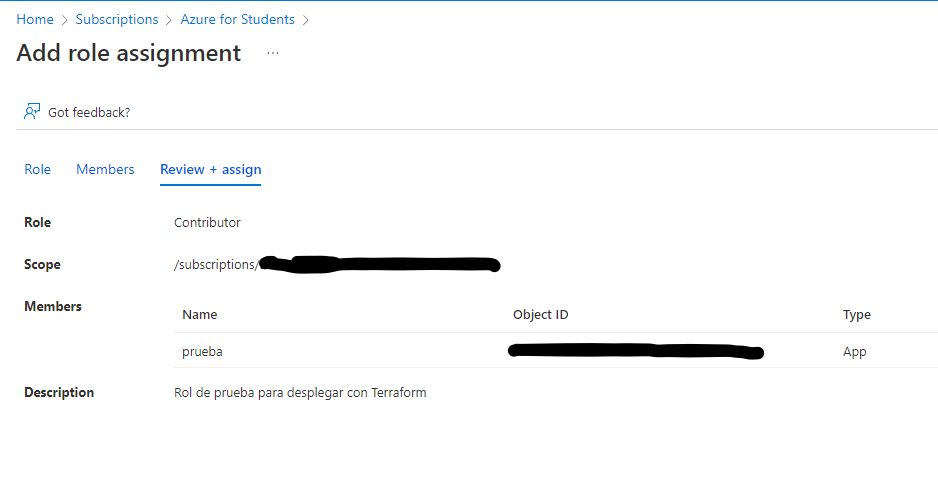

# Proyecto para explorar Terraform

#### _Configuración base_

Con nuestro repositorio de GIT iniciado y configurado correctamente pasamos a la configuración. Necesitaremos descargarnos el Azure cli de Microsoft y Terraform, ambas herramientas las descargaremos dado que lo ejecutamos desde un terminal windows.
Con todo instalado, usamos `az login` para conectarnos. Esto nos abrira una web para logearnos, y nos devolverá lo siguiente.

<p align="center">
  
</p>

Para continuar necesitamos tambien el ID de Suscripcion, que utilizaremos para poder conectar nuestro Terraform con Azure.
Podemos encontrar el ID en la siguiente dirección.

<p align="center">
  
</p>

Tras coger ID correremos los siguiente comandos.
```
az account set --subscription=------------------
az ad sp create-for-rbac --name prueba
```
Justo tras crear el service principal, nos dará informacion muy valiosa que debemos guardar para nuestro Terraform.

<p align="center">
  
</p>

Con esto, podemos observar las imagenes disponibles para desplegar desde el propio cli, tal que:
`az vm image list --output table`

<p align="center">
  
</p>

A la vez que podemos elegir una imagen y aceptar sus terminos:
`az vm image terms show --urn cognosys:ubuntu-21-04:ubuntu-21-04:22.03.28`

<p align="center">
  
</p>

`az vm image terms accept --urn cognosys:ubuntu-21-04:ubuntu-21-04:22.03.28`

<p align="center">
  
</p>


Ahora, para poder crear un despliegue debemos crear un Rol con permisos para Terraform.
Para ello, en `Suscripciones`, seleccionaremos `Access Control (IAM)`, seleccionamos `Add role assignment`. Le daremos el Rol de _"Contributor"_ o Contribuidor a nuestro miembro ya creado, prueba.

<p align="center">
  
</p>

Una vez hecho y desplegado por Azure, podemos comprobar que en `Role Assignmets` nuestro rol _"Prueba"_ ya esta creado y funcional.

